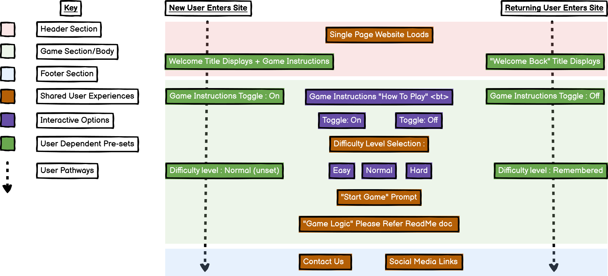
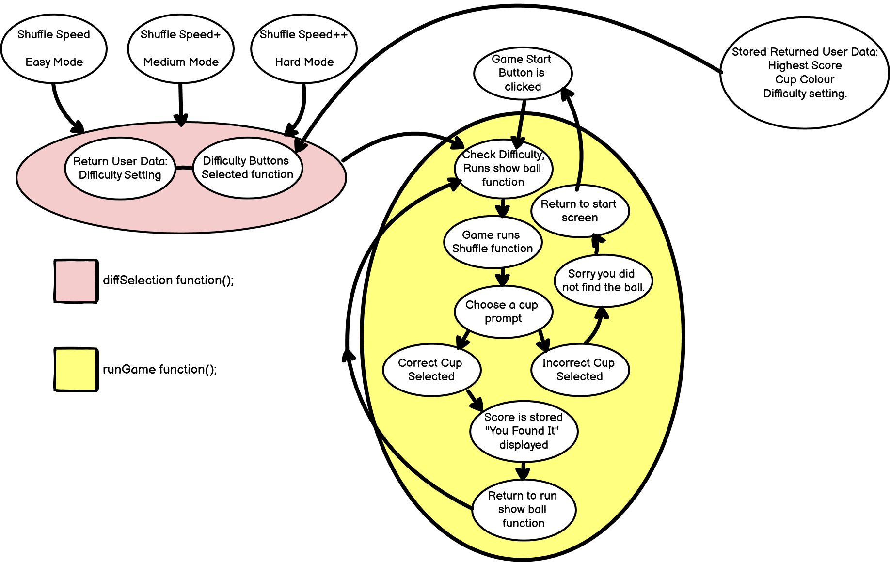
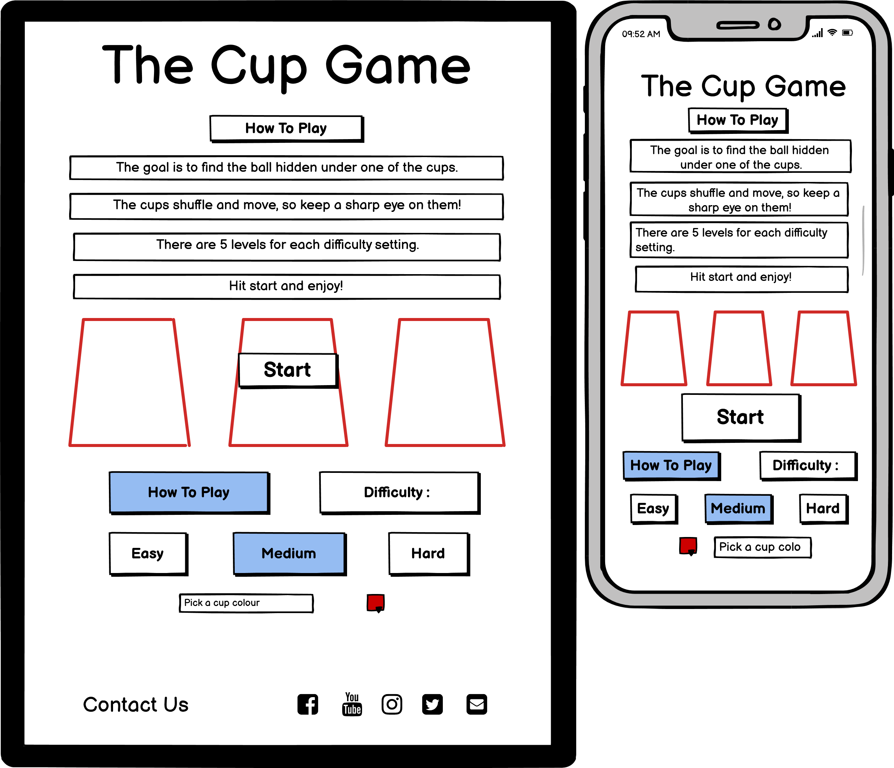
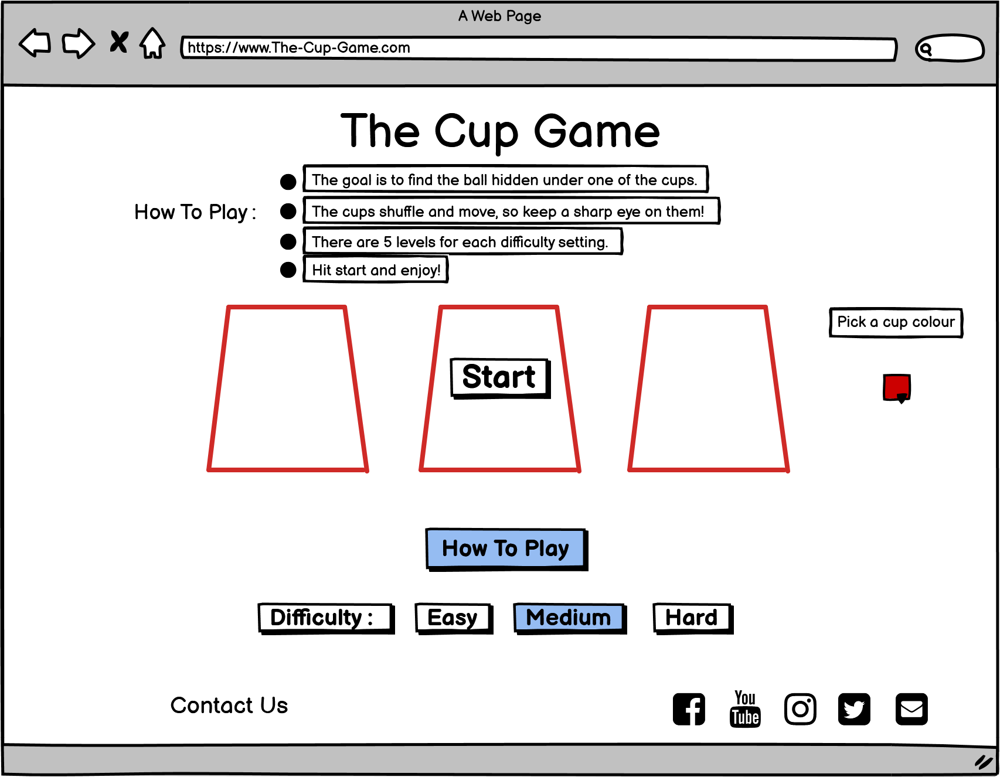
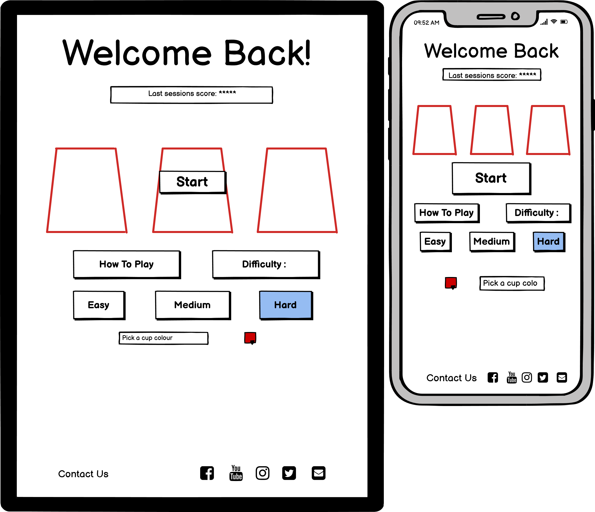
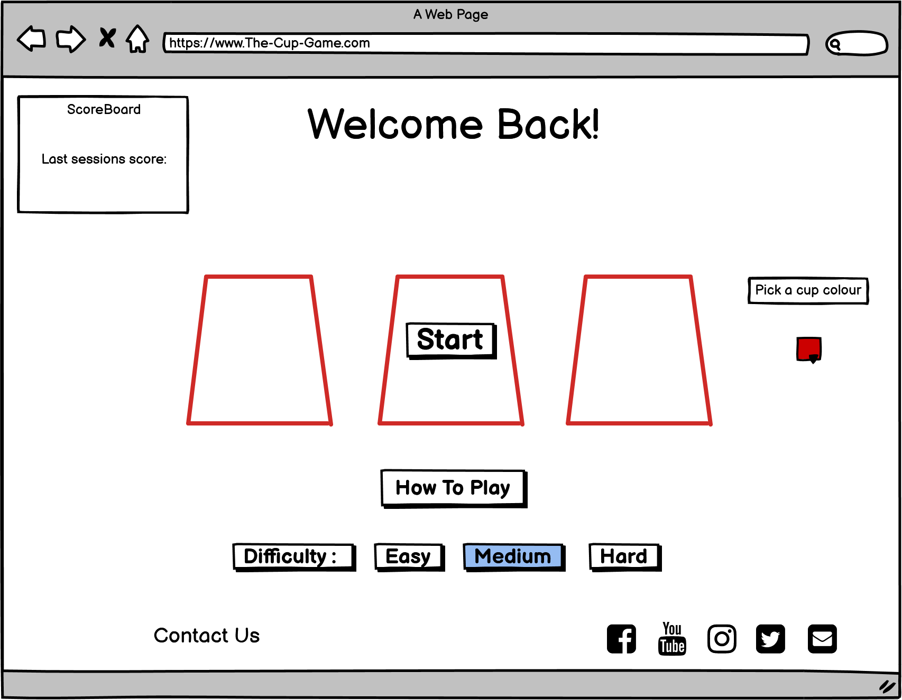

# **The Cup Game**
# INTRODUCTION
---
>The website is focused on the game of “shells”, in this case cups. The site is minimal and elegant, while allowing for a high degree of user interaction and customization. The Cup Game is simple and challenging providing the user with an all round positive experience.

>python3 -m http.server

## CONTENT:
> ## - [UX](#ux-deployment)
> ## - [FEATURES](#features)
> ## - [TECHNOLOGIES USED](#technologies-used)
> ## - [TESTING](#testing)
> ## - [DEPLOYMENT](#deployment)
> ## - [CREDITS](#credits)
---
# UX
---
### **STRATEGY, SCOPE & STRUCTURE**

**The Cup Game:**
>Three identical cups are displayed side-by-side in a line; the ball is shown to be under one of the cups. The cups are then shuffled randomly over a period not exceeding 5 seconds. The player then clicks the cup they think the ball is under. If they guess right, they have won that game of cups and progress

**Creator Goals:** 
> * I want users to have an enjoyable experience playing the cup game. It should be easy to understand but challenging to beat.
> * The user interaction should be slick and customizable to keep gamers coming back.
> * This is an observation game not a memory game, so the difficulty will be changeable to give all users a fun experience.

**Games Target User:** 
> * People of all ages.
> * Users interested in an observation-based game.
> * People with any device type (mobile-first design).

**New User:** 
> * As a new user, I want to quickly understand the core game concepts, so I can enjoy playing sooner. 
> * As a new user, I want a fun and interactive experience regardless of the device I am playing on.
> * As a new user, I want to be able to change the difficulty of the game, so I can have an experience tailored for me.

**Returning User:** 
> * As a returning user, I want my score to be saved, so I can compete and beat my PB’s.
> * As a returning user, I want to be able to make suggestions, to better improve the experience.
> * As a returning user, I want to be able to customise the game in some way, to make it more appealing to my tastes.

**User Pathway:** 
> * The single paged website will cache/load cosmetic changes and game results to better engage users, personalising the experience by differentiating between new and returning users.
>
>
> 

**Game Logic**
>
>* A basic breakdown of how the game of cups will function. This is to help with JavaScript Implementation of the game.
>
>

**Project Content** 
> *Page Content :*
> * Main Title
> * Game Area
> * Cup Colour Picker
> * Social Media Links
> * Contact Us Form
>

> *Game Content :*
> * Start Game Button
>* Difficulty Setting
> * How To Play Button
>
 
### **SKELETON & SURFACE**

**Wireframes - New User**
>*Moblie + Tablet*
>
>
>
> * As a new user the how to play button is already toggled on, this is to aid in usability. This site layout is consistent for all device sizes. The game is centralised to draw focus, and will be contrasted against the background. 

>*Desktop*
>
>
>
> * Using the desktop space to focus on the game, leaving plenty of room to draw the eye.

**Wireframes - Return User**
>*Moblie + Tablet*
>
>
>
> * For returning users, the how to play button is toggled off. In its place is a previous score display, and their last selected cup colour is set to current colour. 

> *Desktop*
>
>
>
> * Following the style and content formatting of the smaller devices, with the expection of the off center "previous score" display and colour picker.

**Colour Scheme & Background**
> The pictures used for the project were of natural landscapes with high ratios of green, blue, white, and brown colouring. Therefore, the stylistic choice was to use off white/grey colouring with opacity for the footer element. The Header was a solid grey colour to block content scrolling under as the user move the page up. The colour scheme along with subtle, thin borders around content elements gave a natural feel to the site overall.
>
>   *Navigation background colour*
> * Hex  (#cfcccc)
>
>  *Footer background colours:*
> * rgba(185, 185, 185, 0.5)
>  
>  *Content background colour:*
> * rgba(255, 255, 255, 0.5 - 0.7)

**Buttons & Links**

>To aid usability links and buttons followed the same style. Notably changing from black to white when hovered over. This is a sharp contrast and a nod to New Zealand Sports and Culture as white and black have long been the colour scheme for the country in many regards.

---
# FEATURES
---
>**Website Features -**
> * Simple, easy to understand layout with user feedback on all links both internal and external.
> * Bootstrap based navigation header, with collapse function in mobile view.
> * Social links in footer element, along with copywrite information.
> * Short introduction text to info user of the goal of the site.
>
>**Game Features**
> * A section containing  condensed information about New Zealand.  
> * Links within the section that will take user to the source material.
>
>
>**Gallery Page / Google Maps Location Links -**
> * Multiple images of New Zealand.
> * Additional information provided on pictures from captions underneath. 
> 
>
>**Get In Touch Page / User Form submission -**
> * Concise form with active feedback for the user.
> * Allows them interaction between the Site operators and the users of said website.
>
>

## **Existing Feature**
> * **Header Navigation :**  Allows the user to navigate through the sites four pages.
> * **Footer Section :** 
> 1. Contact Us - A link to a pop up modal that contains the form for getting in touch. 
> 2. Copywrite -  A small static element displaying the site creator and year of implementation.
> 3. Social Media - Multiple links throught to big social media site.
>* **About page :** Bootstrap cards with relevant images, information and links through to Wikipedia source material.
> * **Gallery page :** Contains pictures and videos of New Zealand. With accompanying text describing location (on large and medium devices)
> * **Get In Touch page :** A form set up to give the site operator more information about the users of the site to help with targeting. And a way for the users to give feedback, express ideas and enquiry about the site/ content presented on it. 
---
# TECHNOLOGIES USED
---
> * [HTML5](https://html.com/html5/) : The markup language used for structuring and presenting content on the Discover New Zealand website.
> * [CSS3](https://html.com/css/) : The language that defines the presentation of a website Discover New Zealand.
> * [BOOTSTRAP V4.6](https://getbootstrap.com/docs/4.6/getting-started/introduction/) : Used in the project to create a mobile-first designed website. It is the most popular front-end open source toolkit.
> * [FONT AWESOME](https://fontawesome.com/) : Used in the project to provide vector icons and social media logos.
> * [GOOGLE FONTS](https://fonts.google.com/) : Provided typography to the project. It is a robust collection of open source designer web fonts.
> * [TINY PNG](https://tinypng.com/) : Used to reduce the file size of PNG files in the project.
> * [BALSAMIQ](https://balsamiq.com/) : Used to create a table and multiple wireframes for the project. Licence provided by [Code Institute](https://codeinstitute.net/).
> * [GITPOD](https://www.gitpod.io/) : The interaction development environment (IDE) used to write the projects code.
> * [GITHUB](https://github.com/) : Provides hosting for software development version control using Git. The host of this project.
> * [GIT](https://git-scm.com/) : Git is a free and open source distributed version control system.
---
# TESTING
---

---
# DEPLOYMENT
---
**How Do I Create A Project :**
> 1. Sign on to github/create a new account.
> 2. Select New Repository.
> 3. Name the repository and click the green button.
> 4. You will be taken to gidpod where you can start coding.

**How I Deploy The Project To GitHub :**
> 1. Log on to [GitHub](https://github.com/), clicked the repository named [discover-new-zealand](https://github.com/5-ean/discover-new-zealand).
> 2. Select the settings tab and scroll to the section headed GitHub Pages.
> 3. In the sub-heading of Source, select the master branch and then save.
> 4. The site is now deployed and a live [link](https://5-ean.github.io/discover-new-zealand/) is given.

**How Do I Fork The Repository :**
> 1. Go to the discover-new-zealand repository.
> 2. Click Fork button in the very top right corner of the browser.
> 3. This creates a copy.
> 4. You can now click pull request and within the dropdown select New Pull Request.

**How To Deploy Locally :**
> 1. Log on to [GitHub](https://github.com/), clicked the repository named [discover-new-zealand](https://github.com/5-ean/discover-new-zealand).
> 2. Select the dropdown tab "Code" and choose Download ZIP.
> 3. Un-zip files and it's ready to use on your local environment.
---
# CREDITS
---
**Hints/Tips/Documentation**
> * [W3School](https://www.w3schools.com/) - For general HTML 5 & CSS 3 help.
> * [Stack Overflow](https://stackoverflow.com/) - Used for specific problems and fixes.
> * [Bootstrap Documentation](https://getbootstrap.com/docs/5.0/getting-started/introduction/) - Informing layout and content of website. Instrumental in execution of project.
> * [Google](https://www.google.com/) - When in doubt...

**References**
> * [Code Institute](https://codeinstitute.net/) - Project inspired by Rosie (resume-project) & Whiskey Drop project.
> * [Wikipedia](https://www.wikipedia.org/) - Pages used as links in 'about.html' learn more buttons.
> 1. History link and section - https://en.wikipedia.org/wiki/History_of_New_Zealand
> 2. Wildlife link and section - https://en.wikipedia.org/wiki/Biodiversity_of_New_Zealand
> 3. Activites link and section - https://en.wikipedia.org/wiki/Tourism_in_New_Zealand
> * [Google maps](https://www.google.co.uk/maps) - Used for pindrop link in bootstrap carousel caption area.
>
>**Text & Images** - Text generation by myself and [Wikipedia](https://www.wikipedia.org/). Background images and gallery elements for the Project were taken by myself.
> * [Pixabay](https://pixabay.com/) - Image of Beer Cup take us from site.
Cup (cup.png) - Picture uploaded by mirandableijenberg.

**Special Mentions**
> * Code Institute/Slack community  - for the support and motivation
> * Rohit Sharma - For the support, motivation and excellent feedback. 